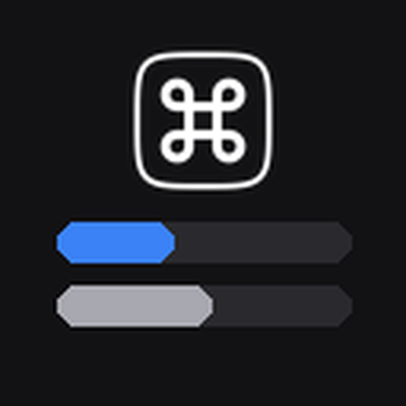
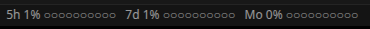
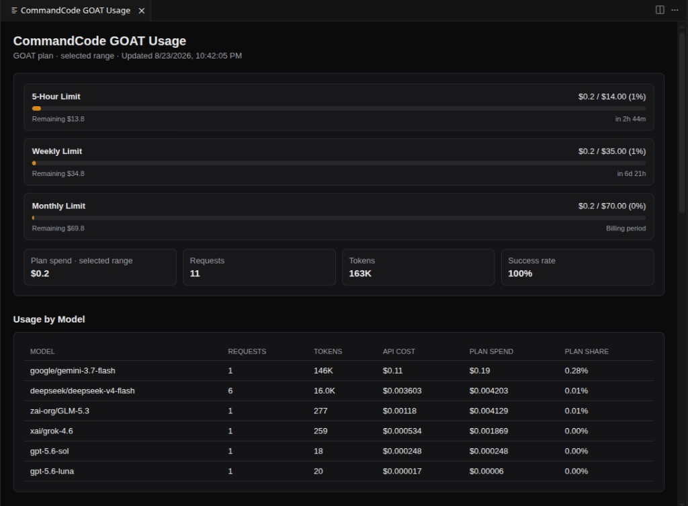

# CommandCode GOAT Usagebar



Monitor CommandCode GOAT quota, model usage, plan spend, and usage history directly in the Cursor or VS Code status bar.

[](LICENSE)
[](https://code.visualstudio.com/)

## Why use it?

The status bar gives you an at-a-glance view of the three usage pools:

```text
5h 72% ●●●●●●●○○○   7d 45% ●●●●○○○○○○   Mo 25% ●●○○○○○○○○
```

Click the indicator to open a dashboard with quota cards, model totals, token counts, plan spend, charts, and recent usage history.



## Quick start

### Install the included VSIX

1. Open Cursor or VS Code.
2. Open the Command Palette with `Ctrl+Shift+P` or `Cmd+Shift+P`.
3. Run **Extensions: Install from VSIX...**.
4. Select `commandcode-goat-usagebar-0.1.7.vsix` from this repository.
5. Reload the editor.

The extension is currently distributed as a VSIX. The same package can be published to an extension registry later without changing the extension commands or settings.

### Authenticate

The extension checks these sources in order:

1. `COMMAND_CODE_API_KEY` or `COMMAND_CODE_SESSION_COOKIE` environment variables
2. Credentials saved through the extension commands in VS Code SecretStorage
3. `~/.commandcode/auth.json` for API-key discovery

If the status bar shows a key icon, run **CommandCode Usagebar: Refresh** or **CommandCode Usagebar: Set API Key** from the Command Palette.

## Features

- Five-hour, weekly, and monthly quota indicators
- Per-model request, token, cost, and GOAT plan-spend totals
- Daily plan-spend and token charts for `1d`, `7d`, `30d`, or custom ranges
- Recent usage history and UTC timestamps
- Secure API-key and Studio-session-cookie storage through SecretStorage
- Local Chart.js bundle for dashboards without a CDN requirement
- Refresh interval and history-size settings



## Credentials and privacy

API keys and Studio session cookies are sensitive credentials. Use the editor command to save them; they are stored through VS Code SecretStorage and are not printed by the extension’s logging helpers. Never paste a cookie into an issue, pull request, screenshot, or chat.

Quota and usage requests are sent to CommandCode endpoints listed in the source adapter. Detailed usage uses internal CommandCode endpoints that may change or require a session cookie. The extension does not add an analytics or telemetry service of its own.

To remove saved credentials, run **CommandCode Usagebar: Clear Studio Session Cookie** or **CommandCode Usagebar: Clear Saved API Key**.

## Troubleshooting

### Quotas are visible but charts are empty

Detailed Studio history may require a session cookie. Open CommandCode Studio’s Usage page, copy the request cookie from the browser network panel, then use **CommandCode Usagebar: Set Studio Session Cookie**. Never share that value.

### The data looks stale

Run **CommandCode Usagebar: Refresh**. The detailed endpoint can have short delays or missing records because it is not a documented public API.

## Development

```bash
npm ci
npm test
npm run typecheck
npm run build
npm run package
```

The release package contains the bundled runtime and local chart library. Source maps are excluded from release builds.

## Related projects

- [Cursor Usagebar](https://github.com/berkeduruu/Cursor-Usagebar) — usagebar for Cursor’s included and other model pools
- [Video Frame Grabber](https://github.com/berkeduruu/Video-Frame-Grabber) — desktop video frame extraction for computer-vision datasets
- [YOLO Supported Annotation Tool](https://github.com/berkeduruu/YOLO_Supported_Annotation_Tool) — hybrid auto-labeling and manual annotation

If this extension saves you time, starring the repository helps other developers find it.

## License

MIT. See [LICENSE](LICENSE).
